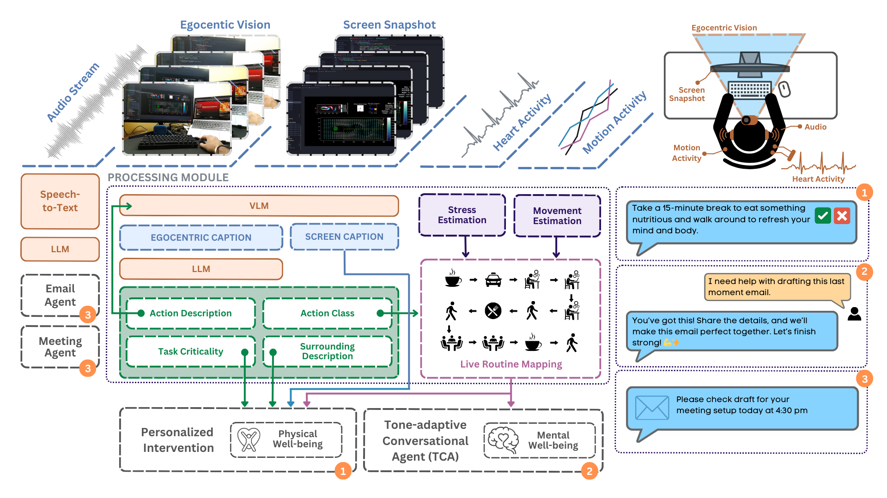
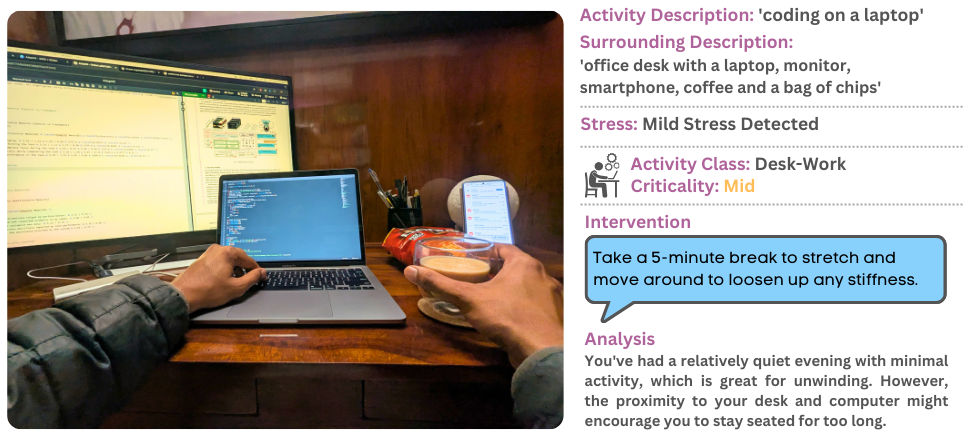

# AdaptAI ♻

_AdaptAI work is accepted at CHI 2025; Late-Breaking Work [[Paper Link🔗](https://programs.sigchi.org/chi/2025/program/content/194447)]_

### **_A Personalized Solution to Sense Your Stress, Fix Your Mess, and Boost Productivity_**



AdaptAI is a research project focused on AI-driven personalization to boosting workplace productivity and well-being. By integrating egocentric vision, audio, physiological signals, motion data and leveraging Large Language Models (LLMs) and Vision-Language Models (VLMs), AdaptAI offers:

- **Physical Well-being Support**: Timely interventions, such as movement reminders and micro-break suggestions.
- **Mental Well-being Assistance**: A Tone-Adaptive Conversational Agent (TCA) that provides tone supportive interactions during stress phases.
- **Task Automation**: AI agents handle small routine tasks like scheduling meetings and drafting emails.

## AdaptAI in Wild

<p align="center">
  
</p>

## Further Details

### Model and API Keys

We utilized Open-Source Groq Hosted Models during the development and testing. During theses phases some models used were under Groq Preview Models category. To run AdaptAI, pyou need to provide your own Groq-API-Key.

### Hardware Specifications

- _Logitech C920 HD Pro Webcam_ (used for egocentric camera)
- _MoveSense HR2_ (used for ECG, Heart Rate Monitoring and Motion Data)

## Citation

Please cite the following if you reference our work.

```
to be added
```

## Acknowledgement

A big thank you to everyone who took part in our user study and to those who helped create the demo video! A special thanks to Groq for their incredibly fast model inference times!
